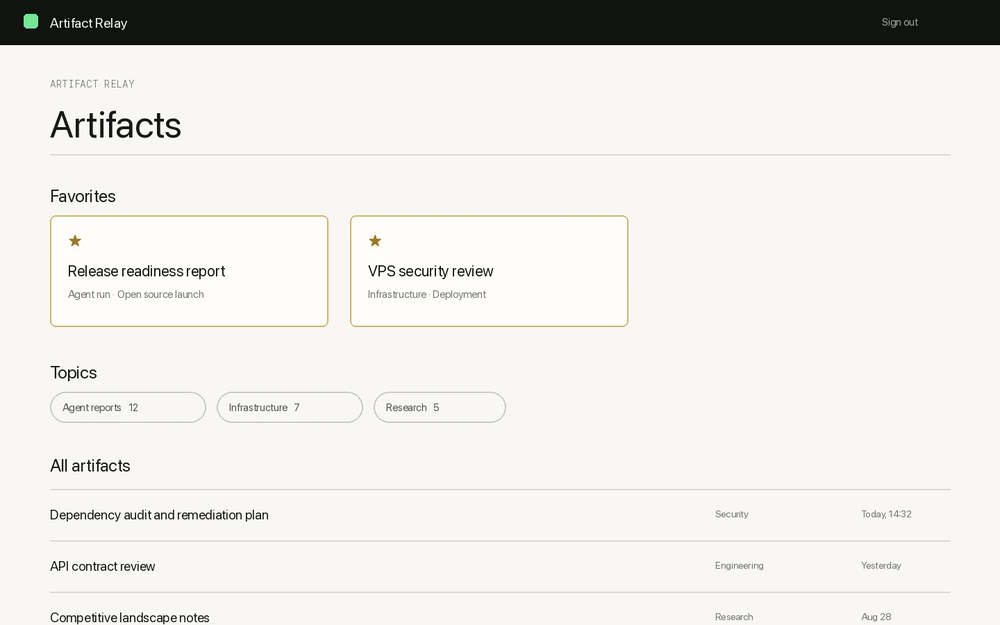

# Artifact Relay

Artifact Relay is a small, self-hosted, single-user service for publishing Markdown or
standalone HTML as mobile-friendly web pages. A bearer-authenticated API publishes immutable
artifacts; viewers log in with one password. Optional, revocable share links can grant access
to one artifact without exposing the private library.

**Website:** <https://eloktev.github.io/artifact-relay/>

[Install for Hermes Desktop](hermes://plugin/install?repo=eloktev/hermes-artifact-relay&enable=1) · [Try the managed beta](https://relay.lok-labs.com/) · [Star Artifact Relay on GitHub](https://github.com/eloktev/artifact-relay)

[](https://eloktev.github.io/artifact-relay/)

*Product UI illustration with synthetic report titles; it represents the v1.1.0 library, not customer evidence.*

## Managed beta

**Don’t deploy Artifact Relay. Ask your agent to connect it.** The recommended path gives you a
private Artifact Relay hosted and maintained by Lok Labs, while keeping the publish credential local
to Hermes:

```sh
hermes plugins install eloktev/hermes-artifact-relay
hermes artifact-relay setup
```

[Connect with Hermes](https://relay.lok-labs.com/) to start device authorization. Hermes stores the
credential outside chat and model output, verifies the endpoint, and publishes a test artifact.

Using Hermes Desktop? [Install the plugin in one click](hermes://plugin/install?repo=eloktev/hermes-artifact-relay&enable=1),
then run `hermes artifact-relay setup`. Hermes always shows a confirmation dialog before installing.

**Managed beta — free during beta. Planned price: $24/year. Limited availability.** Early customer
instances use separate containers, volumes, hostnames, and credentials. Self-hosting remains fully
supported below.

- Markdown is sanitized; standalone HTML runs in a sandboxed, capability-scoped iframe.
- Artifact IDs are opaque, payloads and login attempts are bounded, and logs redact secrets.
- SQLite metadata and artifact bytes live in one persistent Docker volume.
- Mermaid, syntax highlighting, and DejaVu fonts are bundled; pages make no CDN requests.

## Localhost quick start

Requirements: Docker Engine with Compose v2, OpenSSL, and a POSIX shell.

```sh
docker build -t artifact-relay:1.1.0 .
./scripts/bootstrap.sh
docker compose up -d
docker compose ps
curl -fsS http://localhost:8000/api/health
```

Open <http://localhost:8000>. The bootstrap script prompts for the viewer password without
echoing it, hashes it inside the application image, generates independent random API and session
secrets, and creates `.env` with mode `0600`. It refuses to overwrite an existing file.

The default Compose deployment is intentionally local-only:

- port 8000 binds to `127.0.0.1`;
- `BASE_URL=http://localhost:8000`;
- `COOKIE_SECURE=false` because local HTTP cannot set Secure cookies;
- `SHARE_LINKS_ENABLED=false`;
- data persists in the named volume `artifact-data`.

The default Compose deployment keeps building the checkout and gives it the readable local tag
`artifact-relay:1.1.0`. This source-build path remains the default.

Release tags publish multi-architecture images to GHCR only from strict `vX.Y.Z` tags that match
the version in `pyproject.toml`. For release `v1.1.0`, inspect
`ghcr.io/eloktev/artifact-relay:v1.1.0` and resolve its manifest-list digest before deployment:

```sh
docker buildx imagetools inspect ghcr.io/eloktev/artifact-relay:vX.Y.Z --format '{{json .Manifest.Digest}}'
export ARTIFACT_RELAY_DIGEST='<the 64 hexadecimal characters after sha256:>'
./scripts/bootstrap.sh
docker compose -f docker-compose.yml -f deploy/compose.ghcr.yml up -d
```

The GHCR override constructs only
`ghcr.io/eloktev/artifact-relay@sha256:${ARTIFACT_RELAY_DIGEST}`. It cannot consume a mutable
tag, disables the source build, and pulls only when that exact digest is absent locally. Never copy
a platform-specific child digest from the image index; use the manifest-list digest printed by the
preflight command. Keep using the localhost quick start above to build from source.

### Managed tenant deployment

The control plane exports a root/operator-only tenant env file. Validate the exact digest and that
file before rendering, then use all three overrides. The `--env-file` option supplies Compose
interpolation while `ARTIFACT_RELAY_TENANT_ENV` makes the same exported file the container's
runtime env file:

```sh
export ARTIFACT_RELAY_DIGEST='<64 lowercase hexadecimal characters>'
python deploy/validate_managed_deployment.py "$ARTIFACT_RELAY_DIGEST" /secure/tenant.env
ARTIFACT_RELAY_TENANT_ENV=/secure/tenant.env docker compose --env-file /secure/tenant.env -f docker-compose.yml -f deploy/compose.ghcr.yml -f deploy/compose.managed.yml config
ARTIFACT_RELAY_TENANT_ENV=/secure/tenant.env docker compose --env-file /secure/tenant.env -f docker-compose.yml -f deploy/compose.ghcr.yml -f deploy/compose.managed.yml up -d --wait --wait-timeout 120 app
```

The managed override requires the exported HTTPS `BASE_URL`, forces secure cookies, disables
share links, binds the application only to loopback, and persists `/data` in `artifact-data`.

## VPS deployment

For an Internet-facing host, use HTTPS and keep the application port on loopback behind Caddy.
The generic Compose override enables secure cookies and scoped sharing:

```sh
docker compose -f docker-compose.yml -f deploy/compose.vps.yml config
docker compose -f docker-compose.yml -f deploy/compose.vps.yml up -d
```

Replace `artifacts.example.com` in both the override and Caddy example first. Complete setup,
proxy-trust guidance, DNS, and verification are in [docs/VPS.md](docs/VPS.md).

## Configuration

Secrets belong only in `.env`; use `scripts/bootstrap.sh` rather than editing placeholder secrets.
At startup the application rejects the documented placeholder token and signing key, malformed or
non-Argon2id password hashes, and sharing enabled on a non-HTTPS `BASE_URL`.

| Variable | Local value / default | Purpose |
| --- | --- | --- |
| `ARTIFACT_API_TOKEN` | generated | Bearer credential for publish/read/delete API calls. |
| `VIEW_PASSWORD_HASH` | generated Argon2id hash | Viewer password verifier; never store plaintext. |
| `SESSION_SECRET_KEY` | generated | Signs viewer and capability cookies/tokens. |
| `BASE_URL` | `http://localhost:8000` | Exact public origin, without trailing slash. |
| `DATA_DIR` | `/data` | SQLite database and artifact files. |
| `COOKIE_SECURE` | `false` locally | Must be `true` behind HTTPS. |
| `SHARE_LINKS_ENABLED` | `false` locally | Enables scoped sharing only on an HTTPS origin. When false, the share UI is absent and all `/s/*` plus share-management routes return `404`, including previously created links. |
| `FORWARDED_ALLOW_IPS` | `127.0.0.1` | Proxy peers uvicorn may trust; never use `*` on an exposed port. |
| `DEFAULT_TTL_DAYS` / `MAX_TTL_DAYS` | `30` / `3650` | Default and maximum artifact retention. |
| `MAX_CONTENT_BYTES` | `5242880` | Source body limit. |
| `MAX_ASSETS` / `MAX_ASSET_BYTES` | `20` / `20971520` | Attachment count and aggregate byte limit. |
| `LOGIN_MAX_ATTEMPTS` / `LOGIN_WINDOW_SECONDS` | `10` / `900` | Login throttle. |
| `LOGIN_MAX_CONCURRENT_VERIFICATIONS` | `4` | Process-wide Argon2 memory-admission bound. |

See [.env.example](.env.example) for the complete non-secret configuration template.

## API

Interactive documentation is at `/api/docs`; OpenAPI JSON is at `/api/openapi.json`.

Publish Markdown:

```sh
curl -fsS -X POST http://localhost:8000/api/artifacts \
  -H "Authorization: Bearer $ARTIFACT_API_TOKEN" \
  -F 'title=Release report' \
  -F 'summary=Deployment results and follow-up actions' \
  -F 'format=markdown' \
  -F 'expires_in_days=30' \
  -F 'content=@report.md;type=text/markdown' \
  -F 'assets=@latency.png'
```

Important routes:

| Route | Authentication | Purpose |
| --- | --- | --- |
| `POST /api/artifacts` | bearer token | Publish source and optional assets. |
| `GET /api/artifacts/{id}` | bearer token | Read metadata and original source. |
| `DELETE /api/artifacts/{id}` | bearer token | Permanently delete an artifact. |
| `GET /api/health` | none | Health probe with no secret data. |
| `GET /` and `GET /a/{id}` | viewer session | Library and rendered artifact. |
| `POST /a/{id}/shares` | viewer session | Create a scoped share when enabled. |

The bearer token and viewer password are separate trust boundaries. Share links are narrower:
they grant access only to one rendered artifact and its assets, can expire, and can be revoked.
Treat share URLs as credentials.

## Hermes Agent integration

Install the optional portable plugin from its separate repository:

```sh
hermes plugins install eloktev/hermes-artifact-relay --no-enable
hermes config set plugins.entries.artifact-relay.settings.base_url http://localhost:8000
```

Provide `ARTIFACT_RELAY_API_TOKEN` through the secret environment used to launch Hermes,
then enable the plugin and start a new Hermes session:

```sh
export ARTIFACT_RELAY_API_TOKEN='<token generated in .env>'
hermes plugins enable artifact-relay
```

Do not copy the token into `config.yaml`, chat, or an artifact. For a VPS, configure the HTTPS
publisher origin instead. The plugin registers `artifact_publish` and `artifact_read` plus a
bundled skill that automatically turns long results into concise private links. See the
[plugin repository](https://github.com/eloktev/hermes-artifact-relay) for cross-platform
secret setup and immutable installation options.

## Operations

- [Backup and restore](docs/BACKUP_RESTORE.md) — executable scripts, consistency, and verification.
- [Upgrade and rollback](docs/UPGRADE_ROLLBACK.md) — immutable tags/digests and data rollback.
- [Security policy](SECURITY.md) — private vulnerability reporting and deployment controls.
- [Contributing](CONTRIBUTING.md) — tests and quality gates.

## Development

Requires Python 3.12 and [uv](https://docs.astral.sh/uv/).

```sh
uv sync --frozen --extra dev
uv run ruff check .
uv run ruff format --check .
uv run mypy
uv run pytest

docker build -t artifact-relay:local .
./scripts/smoke.sh artifact-relay:local 18080
```

`DEVELOPMENT.md` records the project's test-driven implementation history. Vendored component
provenance and licenses are documented in `THIRD_PARTY_NOTICES.md`.

## License

Artifact Relay is licensed under the [MIT License](LICENSE).
