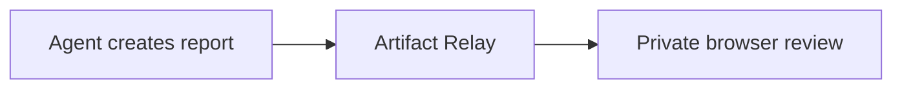

# Agent delivery report

The release-readiness review completed successfully. The service is healthy, the focused checks
passed, and the remaining follow-up is documentation review.

## Summary

| Status | Check | Result |
| --- | --- | --- |
| Passed | Health probe | Service returned `{"status":"ok"}` |
| Passed | Publish workflow | Markdown rendered with expected structure |
| Pending | Documentation review | Owner review scheduled for tomorrow |

## Tasks

- [x] Verify the service health endpoint
- [x] Publish the validation report
- [ ] Review the operator notes with the team

## Verification output

```text
health:  passed
publish: passed
viewer:  passed
```

## Delivery flow


